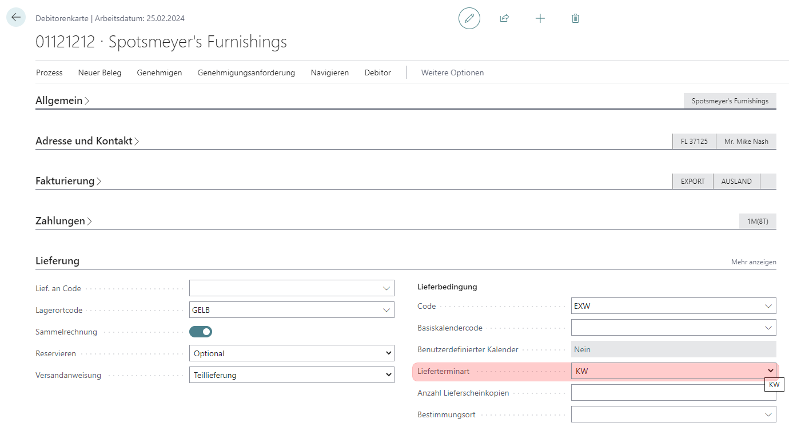
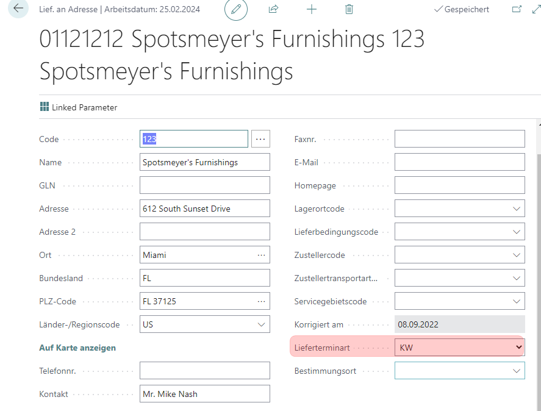
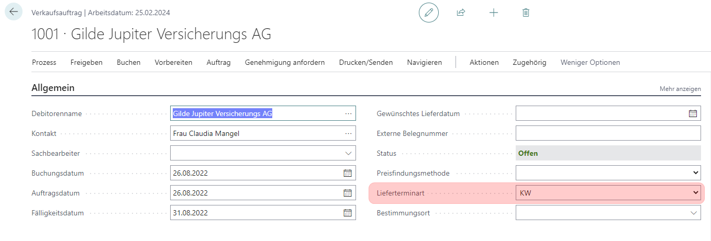

# H22/0423

**VK0014_Einbau und Aufblendung des Feldes -Lieferterminart- auf dem Debitor + Verkaufsbelege**

|                      | -                     |
| -------------------- | --------------------- |
| **Nummer**     | H22/0423              |
| **Kunde**      | SCHOELLERSHAMMER GmbH |
| **Version**    | 1400                  |
| **Datenbank**  | SCHOELLERSHAMMER 14   |
| **App**        | CL                    |
| **Branch**     | SH_Sprint1            |
| **Bearbeiter** | LEBIT\BARTHEL         |
| **Datum**      | 12.09.22              |

# Einrichtung

# Ausführung

# Intern

# Objekte
