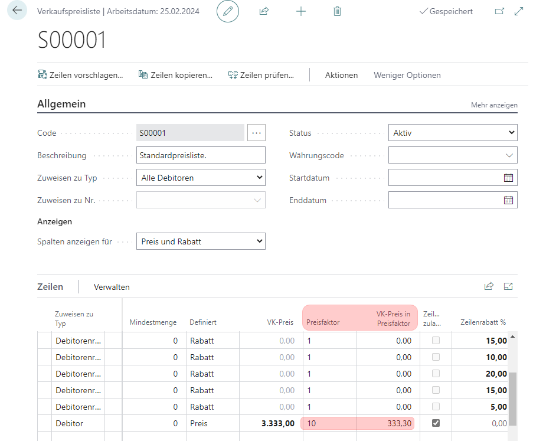
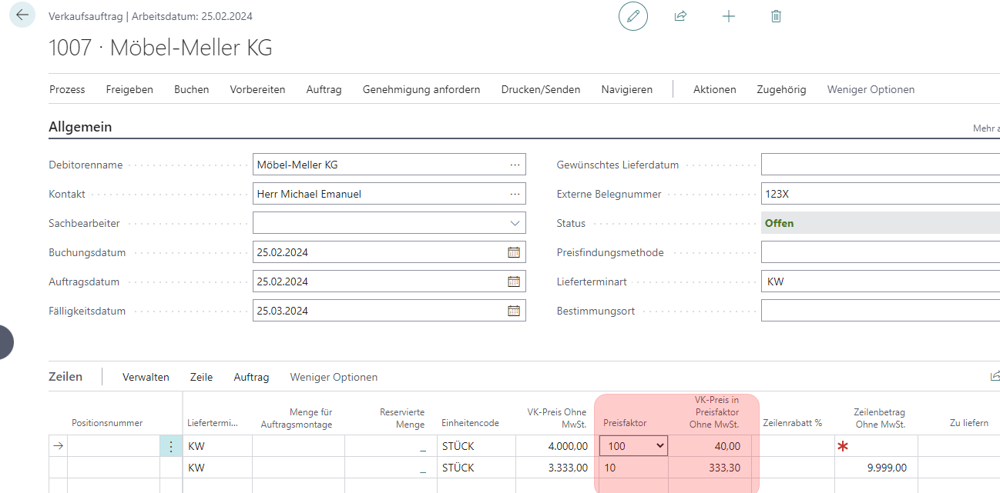

# H22/0437

**VK0029_Preisfaktor-Funktionalitäten in den Verkaufsbelegzeilen**

|                      | -                     |
| -------------------- | --------------------- |
| **Nummer**     | H22/0437              |
| **Kunde**      | SCHOELLERSHAMMER GmbH |
| **Version**    | 2000                  |
| **Datenbank**  | SCHOELLERSHAMMER 20   |
| **App**        | CL                    |
| **Branch**     | SH Sprint 1           |
| **Bearbeiter** | LEBIT\BARTHEL         |
| **Datum**      | 12.09.22              |

# Einrichtung



# Ausführung



# Intern

```csharp
codeunit 5272720 "lbt Corresp. Doc. Mgt"
{
procedure GetPriceFactor(PriceFactor: Enum "lbt cl Price Factor") Result: Decimal
    var
        IsHandled: Boolean;
    begin
        OnBeforeGetPriceFactor(PriceFactor, Ishandled, Result);
}

codeunit 5272721 "lbt Corresp. Doc. Subscriber"
{
[EventSubscriber(ObjectType::Codeunit, Codeunit::"Sales Line - Price", 'OnAfterSetPrice', '', true, true)]
}  
  
```

# Objekte
