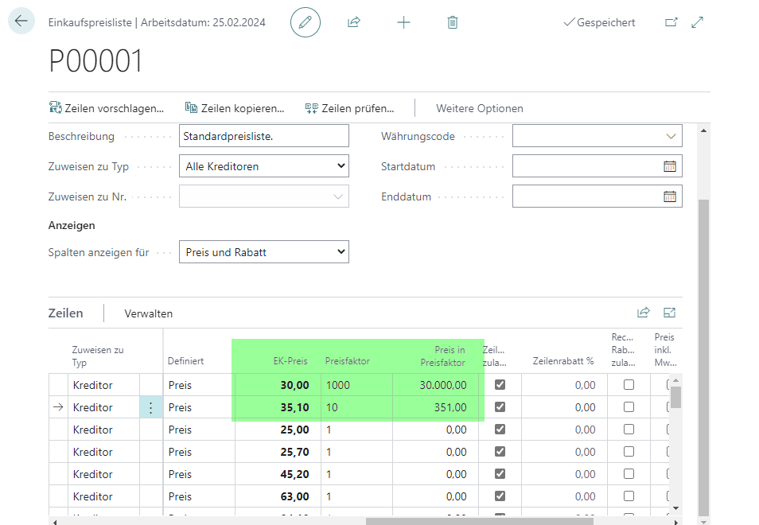
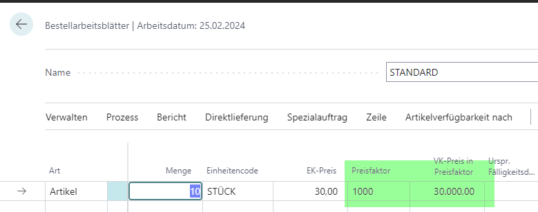
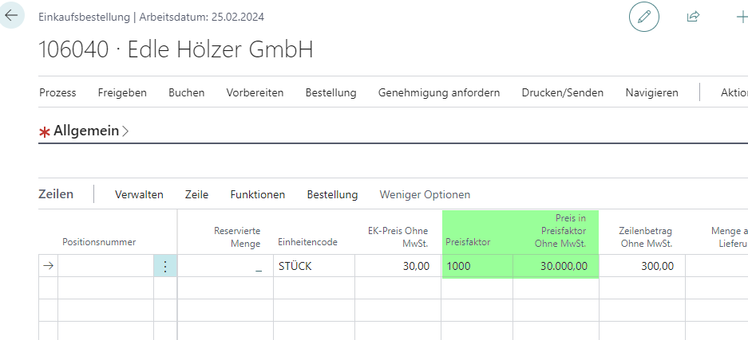

# H22/0522

**EK0002_Preisfaktor/EK-Preis in Preisfaktor**

|                      | -                     |
| -------------------- | --------------------- |
| **Nummer**     | H22/0522              |
| **Kunde**      | SCHOELLERSHAMMER GmbH |
| **Version**    | 2000                  |
| **Datenbank**  | SCHOELLERSHAMMER 20   |
| **App**        | extended kayout       |
| **Branch**     | feature/H22_0522      |
| **Bearbeiter** | LEBIT\BARTHEL         |
| **Datum**      | 26.10.22              |

# Einrichtung

keine

# Ausführung

## Einkaufspreislisten

Da Feld "Preis in Preisfaktor" dient NUR der Anzeige. Es wird im weiterführenden Prozess nicht berücksichtigt



## Bestellarbeitsblätter	



für die Übergabe in die Bestellung musste eine Standardfunktion deaktiviert werden:

Im Standard erfolgt vor der Überrgabe in die Bestellung eine erneute Preisfindung!!


## Einkaufsbestellung:




# Intern

BANF wird hier nicht umgesetzt, das ist eine andere Branchenlösungsapp.

geb. Einkaufslieferungen Page wird nicht umgesetzt, da diese auch im Standard keine Preisfelder hat.

```csharp
codeunit 5272721 "lbt Corresp. Doc. Subscriber"
{
///H22/0522
    [EventSubscriber(ObjectType::Codeunit, Codeunit::"Purchase Line - Price", 'OnAfterSetPrice', '', true, true)]
    [EventSubscriber(ObjectType::Codeunit, Codeunit::"Req. Wksh.-Make Order", 'OnAfterInitPurchOrderLine', '', true, true)]
    [EventSubscriber(ObjectType::Codeunit, Codeunit::"Requisition Line - Price", 'OnAfterSetPrice', '', true, true)]
    ///Schaltet die erneute Preisfindung auf requisitionLine aus  
    [EventSubscriber(ObjectType::Codeunit, Codeunit::"Req. Wksh.-Make Order", 'OnBeforeCopyOrderDateFromPurchHeader', '', true, true)]
    }
```

# Objekte
