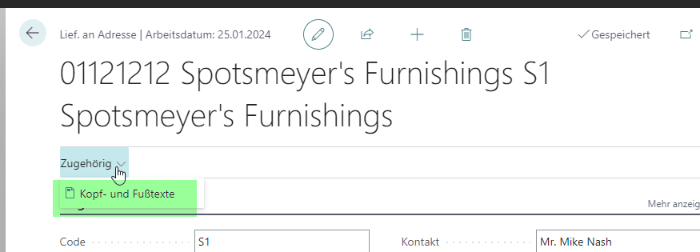

# H22/0582

**VK0048_Erweiterung Dokumentenlayouts an Liefer. an Adresse**

|                      | -                     |
| -------------------- | --------------------- |
| **Nummer**     | H22/0582              |
| **Kunde**      | SCHOELLERSHAMMER GmbH |
| **Version**    | 2000                  |
| **Datenbank**  | SCHOELLERSHAMMER 20   |
| **App**        | LBT_EXTENDED LAYOUT   |
| **Branch**     | feature/shiptoaddress |
| **Bearbeiter** | LEBIT\BARTHEL         |
| **Datum**      | 28.02.23              |

# Einrichtung

keine

# Ausführung




Die Memofindung geht jetzt am Verkauf (T36) beim Validieren des Debitors und "Lief an Code" über beide Tabellen. Es werden vorher IMMER alle Memos gelöscht und dann neu angelegt!!!

# Intern


```csharp
Codeunit Editorhelper
{
if not TargetMemo.Insert() then begin
///Überschreiben erlauben
TableId := SourceMemo.Field(1).Value;
        if TableId in [database::Customer, database::"Ship-to Address"] then
                       TargetMemo.Modify();
end;
}
```

# Objekte
